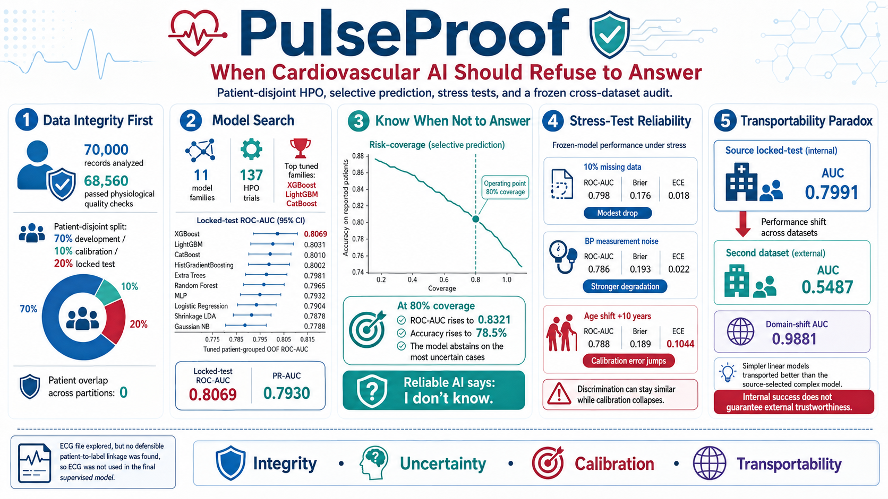

# PulseProof: When Cardiovascular AI Should Refuse to Answer



**Patient-disjoint HPO, selective prediction, stress tests, and a frozen cross-dataset audit show when heart-risk AI stops being trustworthy.**

PulseProof is a reliability-first cardiovascular ML research prototype created for Byte2Beat. It does not stop at an internal benchmark: it verifies patient identity separation, compares 11 model families through 137 successful HPO configurations, freezes decisions before opening the locked test, allows uncertainty-aware abstention, stress-tests calibration, and audits transportability on a second provided dataset.

> **Research and education only. PulseProof is not a medical device and must not be used for diagnosis, treatment, prognosis, screening, or triage.**

## Verified results

| Result | Value |
|---|---:|
| Patients after quality gate | 68,560 |
| Patient overlap across partitions | 0 |
| Locked-test ROC-AUC | **0.8069** |
| Locked-test PR-AUC | **0.7930** |
| Locked-test ECE | **0.0105** |
| Selective coverage | **80.0%** |
| Accuracy on reported patients | **78.5%** |
| Source portable AUC | **0.7991** |
| Second-dataset AUC | **0.5487** |
| Domain-shift AUC | **0.9881** |

## Central findings

1. Patient-disjoint 70/10/20 development, calibration, and locked-test partitions had zero identity overlap.
2. The frozen model is an equal blend of tuned XGBoost, LightGBM, and CatBoost.
3. At 80% coverage, selective prediction increased ROC-AUC to 0.8321 and accuracy to 78.5%.
4. A +10-year age shift preserved much of ROC-AUC while increasing ECE to 0.1044.
5. The source-selected nonlinear model did not transport; simpler linear models ranked better on the second dataset.
6. ECG was not used because no defensible patient-to-label linkage was available.

## Repository structure

```text
pulseproof-byte2beat/
├── app.py
├── pulseproof_runtime.py
├── requirements.txt
├── LICENSE
├── assets/                 # Hero graphic and selected figures
├── notebooks/              # Final public Kaggle notebook
├── results/                # Verified metrics and audit tables
├── model/native/           # Native XGBoost, LightGBM, and CatBoost files
├── docs/                   # Write-up, model card, demo script
├── coder/                  # Coder Terraform template
└── data/README.md          # Official data attachment instructions
```

## Run the demo locally

```bash
python -m venv .venv
source .venv/bin/activate  # Windows: .venv\Scripts\activate
pip install -r requirements.txt
streamlit run app.py
```

## Reproduce the analysis on Kaggle

1. Import `notebooks/PulseProof_Byte2Beat_PatientLevel_HPO_v7.ipynb`.
2. Attach the official Byte2Beat data resource.
3. Run with `RUN_MODE = "competition"`.
4. Download outputs from `/kaggle/working/pulseproof_hpo_v7_outputs`.

## Coder

The `coder/` directory contains a Terraform template that clones this repository, installs dependencies, starts Streamlit, and exposes the application as a public Coder app. The demo uses native model formats instead of a Python pickle, reducing runtime-version fragility. The competition demo should visibly show the active Coder workspace and the running PulseProof application.

## Documentation

- [Final Kaggle write-up](docs/KAGGLE_WRITEUP_FINAL.md)
- [Model card](docs/MODEL_CARD.md)
- [Demo script](docs/DEMO_SCRIPT.md)
- [Raw-data access instructions](data/README.md)

## License

Code is released under the MIT License. Raw competition data are not redistributed.
