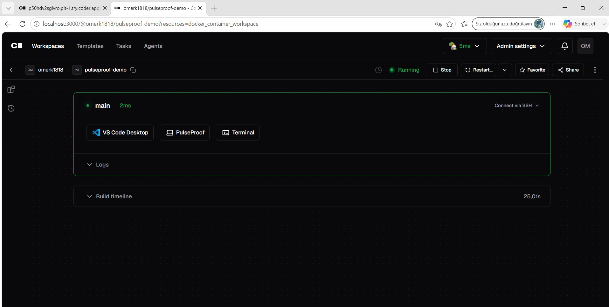

# Coder integration evidence

PulseProof was provisioned and run inside a self-hosted Coder workspace using the Docker template in `coder/`.

## Active workspace

## Application launched from Coder

The application loads the frozen XGBoost, LightGBM, and CatBoost models, reports an ensemble probability, exposes uncertainty, and can return `ABSTAIN` rather than forcing a classification.

The local `localhost` URL shown in screenshots is intentionally not presented as a public live link. Reproducibility is provided through the public repository and the uploadable Coder template ZIP.
